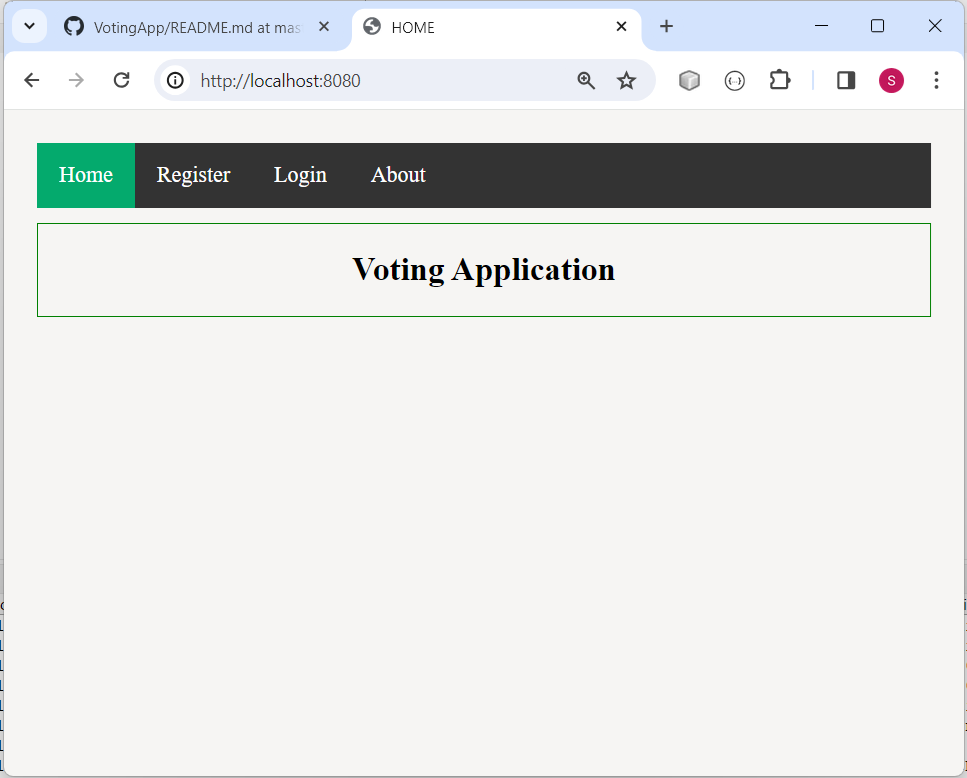

# VotingApp - Springboot, Thymeleaf

### It is a SpringBoot Project with Thymeleaf Frontend. Build in Spring Tool Suite.
## It is a Voting Application. 

### Application Features:
- User can vote for the Candidate.
- Admin has permission to see the vote details.

### Technology used in this Project: 
- i) Thymeleaf, CSS: designing page layout. 
- ii) Java: all the logic has been written in Java. 
- iii) MySQL: MySQL database has been used as a database.
- iv) SpringSecurity: SpringSecurity has been used for authentication.
- v) Hibernate: Hibernate ORM is used.

### Software And Tools Required:
- Java JDK 8+ 
- Eclipse EE or Spring Tool Suite
- MySQL

### Some Screenshots of this Project:

==================================================================================================================================================================

==================================================================================================================================================================

==================================================================================================================================================================

==================================================================================================================================================================

==================================================================================================================================================================

==================================================================================================================================================================

==================================================================================================================================================================

