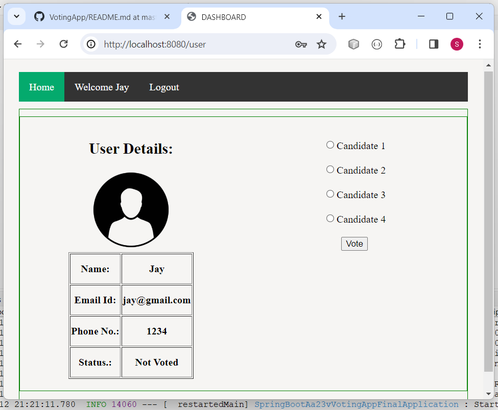
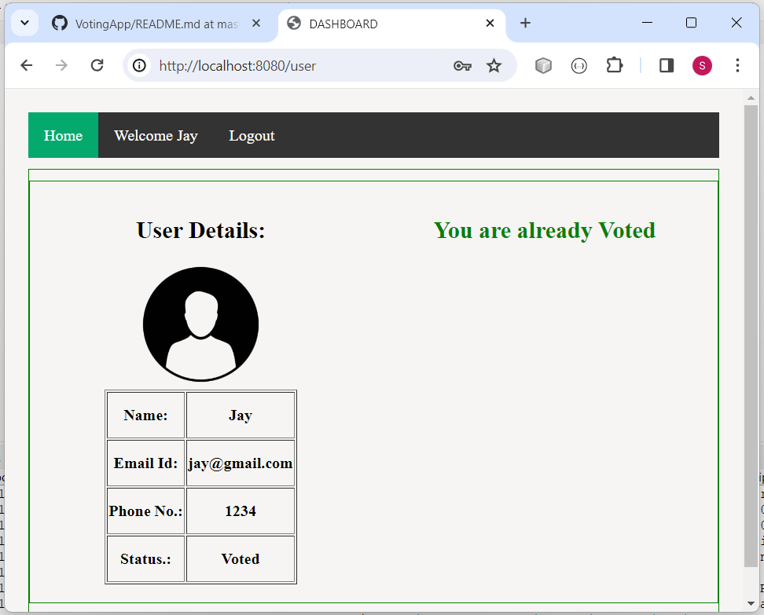

# VotingApp - Springboot, Thymeleaf

 ### Take a look at this Application
url:

### It is SpringBoot Project with Thymeleaf Frontend. Build in Spring Tool Suite.
## It is a Voting Application. 

### Application Features:
- User can vote the Candidate.
- Admin has the permission to see the vote details.

### Technology used in this Project: 
- i) Thymeleaf,CSS : designing page layout. 
- ii) Java : all the logic has been written in java. 
- iii) MySQL: MySQL database has been used as database.
- iv) SpringSecurity: SpringSecurity has been used for authentication.
- v) Hibernate: Hibernate ORM is used.

### Software And Tools Required:
- Java JDK 8+ 
- Eclipse EE or Spring Tool Suite
- MySQL

### Steps To Import And Run The Project in Eclipse EE
- In Eclipse or Spring Tool Suite
- Click on File
- Select Import
- Select Projects from Git(with smart import) -> Next
- Select Clone URI -> Next
- In URI paste this url: https://github.com/swapnilbamble1438/VotingApp.git
  -> Next
-  Now in Local Destination

-  proceed -> Next

            Now only select VotingApp\MySpring_Boot_aa23v_VotingApp_Final
            -> Finish
   
-  If everything goes right Project will get successfully imported
-  Now wait for few seconds for getting things properly loaded

-  Now open Project > src/main/resources > open application.properties file,
   inside this file look for
   
   spring.datasource.url=jdbc:mysql://localhost:3306/springbootnew?serverTimezone=UTC

   
   
 

### Some Screenshots of this Project:

==================================================================================================================================================================

==================================================================================================================================================================

==================================================================================================================================================================

==================================================================================================================================================================

==================================================================================================================================================================

==================================================================================================================================================================

==================================================================================================================================================================

==================================================================================================================================================================

==================================================================================================================================================================

